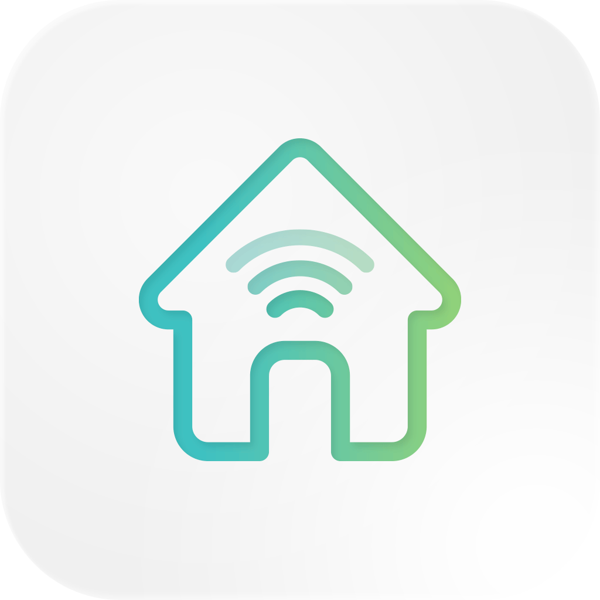

# Smarty

Built using Flutter.

## About Smarty

Smarty is a cross-platform smart home control system built using the Flutter framework. The app is
built for the group project for F29SO - Software Engineering.

## Current Status

The project is currently in it's 2nd stage of three in development.

## Resources
- [Lab: Write your first Flutter app](https://flutter.dev/docs/get-started/codelab)
- [Cookbook: Useful Flutter samples](https://flutter.dev/docs/cookbook)
